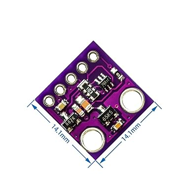

# casa0014_LumiHealth
A device to monitor the health statues of users and create a comfortable light environment for them.

## Inspiration
In the IoT market, smart home devices and wearable medical equipment have always been among the most popular areas. My design philosophy has always been centered on a people-oriented approach. A successful IoT device not only presents technical challenges but also requires careful consideration of social and user needs. During lectures, I learned that IoT devices can improve our quality of life in countless ways. However, the current IoT market has not met expectations or reached its full potential. I believe this is because many products fail to integrate seamlessly into people's daily lives and lack a truly user-centered design.

<table>
  <tr>
    <td align="center" width="33%">
       
      <em>Fig.1 Blood oxygen monitor</em>
    </td>
    <td align="center" width="33%">
       
      <em>Fig.2 Sports bracelet</em>
    </td>
    <td align="center" width="33%">
       
      <em>Fig.3 Smart Home Device</em>
    </td>
  </tr>
</table>

An IoT device, no matter how advanced its technological capabilities, cannot fulfill its purpose if users find it difficult or unappealing to use. This insight inspired me to design Lumi_Health, a health monitoring and environmental optimization system. Lumi_Health is dedicated to keeping users at the core of its design, aiming to enhance user experiences and improve quality of life through simplicity and accessibility.

### Current Application Scenarios
1) Medical Assistance
   Used for data collection and remote monitoring, when the patient's heart rate exceeds the normal threshold, the LED lights up red to alarm.
2) Fitness Tracking
   Use LED to indicate exercise intensity, such as blue means need to increase exercise intensity and red means reduce it.
3) Emotion Regulation
   Create a soothing environment through warm and cool tones or breathing light effects to help users relax.

## Design modes
1) Health status monitor mode: LED color changes can reflect different heart rate ranges.
   1) Blue indicates a lower heart rate(40-60 BPM).
   2) Yellow indicates a normal heart rate(60-85 BPM).
   3) Red indicates a high heart rate(85-120 BPM).
2) Relaxation mode: Adjust the lighting according to different body temperature ranges to create a relaxing atmosphere.
   1) when temperature is low, LED shows warm color breathing effect. 
   2) When temperature is high, LED shows cool color breathing effect;
   
PS: Switch mode by taping the surface of the sensor(when my finger approaches the sensor, the infrared reflection value changes greatly).

## System architecture
The operation of the whole project:
1) Make ensure the operating environment(connect WIFI and MQTT) is set up first;
2) Select the mode;
3) Read the data through the sensor, and then run different functions under the corresponding mode;
4) Publish and subscribe pixel topics through MQTT, update the light status, and realize remote operation.

MAX30102 sensor -> Arduino MKR 1010 -> WIFI -> MQTT broker -> LEDs

# Hardware settings
## Components

<table>
  <tr>
    <th width="15%">Component</th>
    <th width="20%">Image</th>
    <th width="25%">Function</th>
    <th width="25%">Wiring</th>
    <th width="15%">Library</th>
  </tr>
  <tr>
    <td>MAX30102 Sensor</td>
    <td align="center">
      
    </td>
    <td>
      - Heart rate monitoring 
      - Blood oxygen level detection 
      - Temperature sensing 
      - IR reflection value measurement
    </td>
    <td>
      - VIN → 3.3V 
      - GND → GND 
      - SCL → SCL 
      - SDA → SDA
    </td>
    <td>
      - SparkFun MAX3010x library 
      - Wire.h
    </td>
  </tr>
  <tr>
    <td>OLED Display</td>
    <td align="center">
      
    </td>
    <td>
      - Real-time data display 
      - Mode status indication 
    </td>
    <td>
      - VCC → 3.3V 
      - GND → GND 
      - SCL → SCL 
      - SDA → SDA
    </td>
    <td>
      - Adafruit_SSD1306 
      - Adafruit_GFX
    </td>
  </tr>
</table>

## Wiring

## Enclosure
The development of the device's casing was also an iterative process. During the early testing phase, a permanent casing was unnecessary and would have hindered quick adjustments and design iterations. Therefore, I initially used simple cardboard boxes as makeshift casings to facilitate rapid prototyping and modifications.

<table>
  <tr>
    <td align="center" width="33%">
      
    </td>
    <td align="center" width="33%">
      
    </td>
    <td align="center" width="33%">
      
    </td>
  </tr>
</table>

<em>simple cardboard box</em>

As the project progressed and the functions stabilized, it became time to formally consider the casing design. Drawing inspiration from the sleek and ergonomic form of a thermometer, I began creating a modeled design that balanced aesthetics, usability, and practicality. This approach ensured the final casing not only complemented the device’s functionality but also provided a user-friendly experience.

<table>
  <tr>
    <td align="center" width="25%">
       
      <em>Fig.1 Inspiration-Thermometer</em>
    </td>
    <td align="center" width="25%">
       
      <em>Fig.2 3D Model</em>
    </td>
    <td align="center" width="25%">
       
      <em>Fig.3 Build Up</em>
    </td>
    <td align="center" width="25%">
       
      <em>Fig.4 Final Assembly</em>
    </td>
  </tr>
</table>

# Software setup
## Code testing
In the process of designing and writing the code for this project, I started from the demand analysis and gradually conceived the architecture and implementation of the entire system. First, the core function of the project was clarified, that is, real-time monitoring of heart rate and body temperature through the MAX30102 sensor, and intuitive visual feedback through the OLED display and RGB lights, while realizing network publishing and control of data through the MQTT protocol. To this end, I designed the following modules in stages:

1) Hardware initialization and function integration:
   I initialized the sensor (MAX30102) and the display (SSD1306 OLED) to ensure that they can work properly. And the heart rate was extracted by analyzing the photoelectric signal, and the temperature data was collected.

2) Mode switching and interactive control:
   On this basis, in order to enhance the user experience, I designed to switch the monitoring mode (heart rate and temperature) through touch operation. This function is realized by detecting the change of infrared light reflection, combined with the judgment logic of anti-shake and short and long press.

3)Visual effects and real-time updates:
   To improve the visual performance, I wrote a breathing light effect based on heart rate and temperature, and updated the light status to external devices in real time through the MQTT protocol. In addition, I optimized the refresh rate of the OLED display content so that users can get data updates at an appropriate frequency.

## Data visualization
In the process of testing, the serial port monitor of Arduino IDE is used to monitor the running status of the system in real time, which can assist debugging and optimization. 

<table>
  <tr>
    <td align="center" width="33%">
       
      <em>Fig.1 It takes a long time to obtain stable data</em>
    </td>
    <td align="center" width="33%">
       
      <em>Fig.2 Real-time heart rate</em>
    </td>
    <td align="center" width="33%">
       
      <em>Fig.3 Read Temperature</em>
    </td>
  </tr>
</table>

# Achievements
https://github.com/user-attachments/assets/67e5ef44-76ce-48d3-a4db-6cb20c57eb6c

