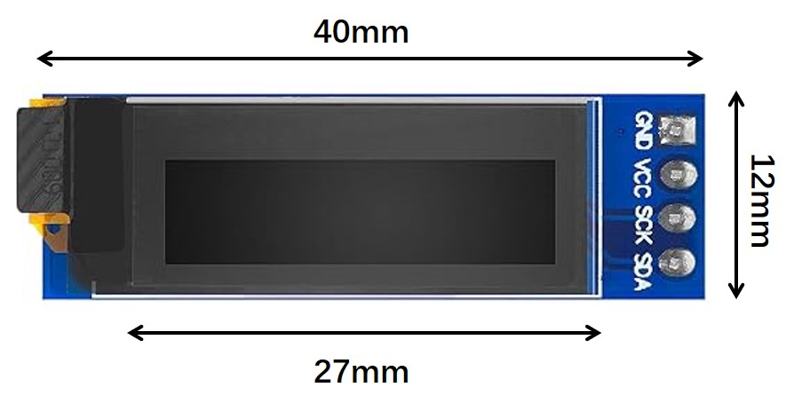

# casa0014_LumiHealth
A device to monitor the health statues of users and create a comfortable light environment for them.

## Inspiration
In the IoT market, smart home devices and wearable medical equipment have always been among the most popular areas. My design philosophy has always been centered on a people-oriented approach. A successful IoT device not only presents technical challenges but also requires careful consideration of social and user needs. During lectures, I learned that IoT devices can improve our quality of life in countless ways. However, the current IoT market has not met expectations or reached its full potential. I believe this is because many products fail to integrate seamlessly into people's daily lives and lack a truly user-centered design.

<table>
  <tr>
    <td align="center" width="33%">
       
      <em>Fig.1 Blood oxygen monitor</em>
    </td>
    <td align="center" width="33%">
       
      <em>Fig.2 Sports bracelet</em>
    </td>
    <td align="center" width="33%">
       
      <em>Fig.3 Smart Home Device</em>
    </td>
  </tr>
</table>

An IoT device, no matter how advanced its technological capabilities, cannot fulfill its purpose if users find it difficult or unappealing to use. This insight inspired me to design Lumi_Health, a health monitoring and environmental optimization system. Lumi_Health is dedicated to keeping users at the core of its design, aiming to enhance user experiences and improve quality of life through simplicity and accessibility.

### Current Application Scenarios
1) Medical Assistance
   Used for data collection and remote monitoring, when the patient's heart rate exceeds the normal threshold, the LED lights up red to alarm.
2) Fitness Tracking
   Use LED to indicate exercise intensity, such as blue means need to increase exercise intensity and red means reduce it.
3) Emotion Regulation
   Create a soothing environment through warm and cool tones or breathing light effects to help users relax.

## Components

<table>
  <tr>
    <th width="15%">Component</th>
    <th width="20%">Image</th>
    <th width="25%">Function</th>
    <th width="25%">Wiring</th>
    <th width="15%">Library</th>
  </tr>
  <tr>
    <td>MAX30102 Sensor</td>
    <td align="center">
      
    </td>
    <td>
      - Heart rate monitoring 
      - Blood oxygen level detection 
      - Temperature sensing 
      - IR reflection value measurement
    </td>
    <td>
      - VIN → 3.3V 
      - GND → GND 
      - SCL → SCL 
      - SDA → SDA
    </td>
    <td>
      - SparkFun MAX3010x library 
      - Wire.h
    </td>
  </tr>
  <tr>
    <td>OLED Display</td>
    <td align="center">
      
    </td>
    <td>
      - Real-time data display 
      - Mode status indication 
    </td>
    <td>
      - VCC → 3.3V 
      - GND → GND 
      - SCL → SCL 
      - SDA → SDA
    </td>
    <td>
      - Adafruit_SSD1306 
      - Adafruit_GFX
    </td>
  </tr>
</table>

## Current modes
1) Health status monitor mode: LED color changes can reflect different heart rate ranges.
   1) Blue indicates a lower heart rate(40-60 BPM).
   2) Yellow indicates a normal heart rate(60-110 BPM).
   3) Red indicates a high heart rate(110-140 BPM).
2) Relaxation mode: Adjust the lighting according to different body temperature ranges to create a relaxing atmosphere.
   1) when temperature is low, LED shows warm color gradients. 
   2) When temperature is high, LED shows cool color gradients;
   
PS: Switch mode by taping the surface of the sensor(when my finger approaches the sensor, the infrared reflection value changes greatly).

## System architecture
The operation of the whole project:
1) Make ensure the operating environment(connect WIFI and MQTT) is set up first;
2) Select the mode;
3) Read the data through the sensor, and then run different functions under the corresponding mode;
4) Publish and subscribe pixel topics through MQTT, update the light status, and realize remote operation.

MAX30102 sensor -> Arduino MKR 1010 -> WIFI -> MQTT broker -> LEDs

## Need to be improved...
1) In the second mode, the gradient of warm and cool tones may not be soothing enough. Later I want to change them to breathing light effect through brightness.
2) Rich lighting effects that adjust in real time based on heart rate can be used as interactive artworks in public spaces or exhibitions to attract audience interaction.
